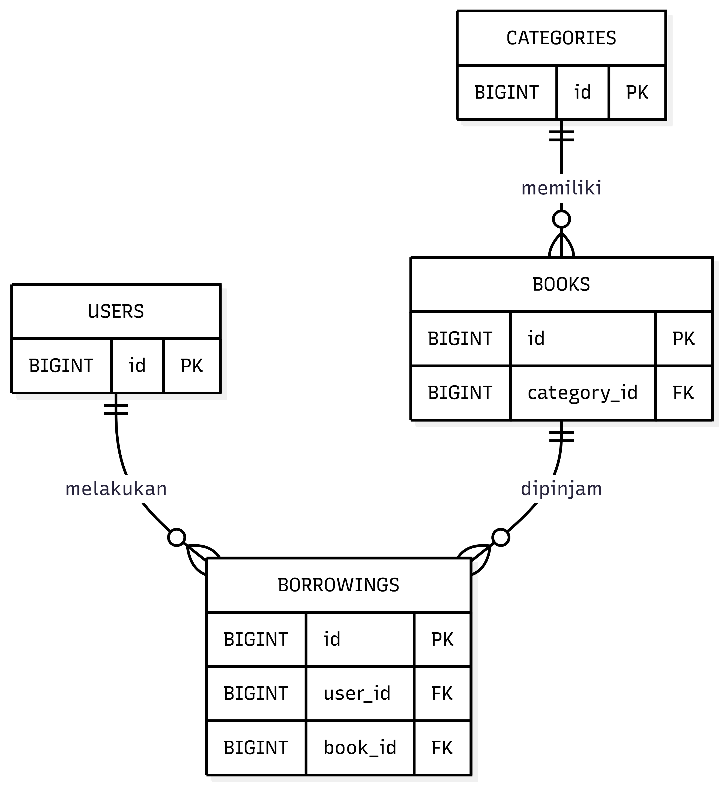

# ERD Sistem Manajemen Buku Digital

Dokumen ini berisi rancangan "Entity Relationship Diagram (ERD)" untuk project "Sistem Manajemen Buku Digital Berbasis REST API".

Sistem ini menggunakan empat tabel utama:

1. `users`
2. `categories`
3. `books`
4. `borrowings`

## 1. Gambaran Relasi Database

| Relasi | Keterangan |
| `categories` ke `books` | Satu kategori dapat memiliki banyak buku |
| `users` ke `borrowings` | Satu user/member dapat memiliki banyak transaksi peminjaman |
| `books` ke `borrowings` | Satu buku dapat memiliki banyak riwayat peminjaman |

## 2. ERD

## 3. Penjelasan Tabel

### 3.1 Tabel `users`

Tabel `users` digunakan untuk menyimpan data pengguna sistem. Pengguna dalam sistem dibagi menjadi dua role, yaitu `admin` dan `member`.

| Kolom | Tipe Data | Keterangan |
| `id` | BIGINT | Primary key |
| `name` | VARCHAR | Nama pengguna |
| `email` | VARCHAR | Email untuk login |
| `password` | VARCHAR | Password yang sudah dienkripsi |  
| `role` | ENUM | Role pengguna: `admin` atau `member` |
| `created_at` | DATETIME | Waktu data dibuat |
| `updated_at` | DATETIME | Waktu data diperbarui |

### 3.2 Tabel `categories`

Tabel `categories` digunakan untuk menyimpan data kategori buku.

| Kolom | Tipe Data | Keterangan |
| `id` | BIGINT | Primary key |
| `name` | VARCHAR | Nama kategori |
| `slug` | VARCHAR | Nama kategori dalam format URL |
| `description` | TEXT | Deskripsi kategori |
| `created_at` | DATETIME | Waktu data dibuat |
| `updated_at` | DATETIME | Waktu data diperbarui |

Contoh kategori:
- Teknologi
- Pendidikan
- Novel
- Agama
- Komputer

### 3.3 Tabel `books`

Tabel `books` digunakan untuk menyimpan data buku. Buku dalam sistem dibagi menjadi dua jenis, yaitu `ebook` dan `physical`.

| Kolom | Tipe Data | Keterangan |
| `id` | BIGINT | Primary key |
| `category_id` | BIGINT | Foreign key ke tabel `categories` |
| `title` | VARCHAR | Judul buku |
| `slug` | VARCHAR | Judul buku dalam format URL |
| `author` | VARCHAR | Nama penulis buku |
| `publisher` | VARCHAR | Nama penerbit buku |
| `publication_year` | INT | Tahun terbit buku |
| `isbn` | VARCHAR | Nomor ISBN buku |
| `description` | TEXT | Deskripsi buku |
| `type` | ENUM | Jenis buku: `ebook` atau `physical` |
| `cover_image` | VARCHAR | Lokasi file cover buku |
| `pdf_file` | VARCHAR | Lokasi file PDF, khusus untuk e-book|
| `stock_total` | INT | Total stok buku fisik |
| `stock_available` | INT | Stok buku fisik yang tersedia |
| `created_at` | DATETIME | Waktu data dibuat |
| `updated_at` | DATETIME | Waktu data diperbarui|

### 3.4 Tabel `borrowings`

Tabel `borrowings` digunakan untuk menyimpan data transaksi peminjaman buku fisik oleh member.

| Kolom | Tipe Data | Keterangan |
| `id` | BIGINT | Primary key |
| `user_id` | BIGINT | Foreign key ke tabel `users`|
| `book_id` | BIGINT | Foreign key ke tabel `books`|
| `borrow_date` | DATE | Tanggal pengajuan peminjaman|
| `due_date` | DATE | Batas tanggal pengembalian |
| `return_date` | DATE | Tanggal buku dikembalikan |
| `status` | ENUM | Status peminjaman |
| `note` | TEXT | Catatan admin |
| `created_at` | DATETIME | Waktu data dibuat |
| `updated_at` | DATETIME | Waktu data diperbarui|

## 4. Aturan Relasi

### 4.1 Relasi `categories` ke `books`

Satu kategori dapat memiliki banyak buku.

Relasi:

**categories.id = books.category_id**

### 4.2 Relasi `users` ke `borrowings`

Satu user/member dapat memiliki banyak transaksi peminjaman.

Relasi:

**users.id = borrowings.user_id**

### 4.3 Relasi `books` ke `borrowings`

Satu buku dapat memiliki banyak riwayat peminjaman.

Relasi:

**books.id = borrowings.book_id**

## 5. Aturan Data Buku

### 5.1 Buku Bertipe `ebook`

Jika buku bertipe `ebook`, maka:

1. Kolom `pdf_file` harus berisi file PDF.
2. Kolom `stock_total` dapat bernilai 0.
3. Kolom `stock_available` dapat bernilai 0.
4. Buku tidak perlu melalui proses peminjaman.
5. Tombol yang ditampilkan di frontend adalah **Baca PDF**.

### 5.2 Buku Bertipe `physical`

Jika buku bertipe `physical`, maka:

1. Kolom `pdf_file` bernilai `NULL`.
2. Kolom `stock_total` harus lebih dari 0.
3. Kolom `stock_available` menunjukkan jumlah stok tersedia.
4. Buku dapat diajukan peminjaman oleh member.
5. Tombol yang ditampilkan di frontend adalah **Pinjam Buku**.

## 6. Aturan Status Peminjaman

Status peminjaman pada tabel `borrowings` terdiri dari:

| Status | Keterangan |
| `pending` | Peminjaman sedang menunggu persetujuan admin|
| `approved` | Peminjaman disetujui oleh admin |
| `rejected` | Peminjaman ditolak oleh admin |
| `returned` | Buku sudah dikembalikan|

Alur status:
pending → approved → returned
pending → rejected

## 7. Aturan Stok

Aturan stok hanya berlaku untuk buku bertipe `physical`.

1. Saat peminjaman dibuat, status awal adalah `pending`.
2. Saat admin menyetujui peminjaman, status berubah menjadi `approved`.
3. Saat status berubah menjadi `approved`, `stock_available` berkurang 1.
4. Saat buku dikembalikan, status berubah menjadi `returned`.
5. Saat status berubah menjadi `returned`, `stock_available` bertambah 1.
6. Jika `stock_available` bernilai 0, member tidak dapat mengajukan peminjaman.

## 9. Kesimpulan

ERD Sistem Manajemen Buku Digital terdiri dari empat tabel utama, yaitu `users`, `categories`, `books`, dan `borrowings`. Relasi database dirancang untuk mendukung fitur utama sistem, yaitu pengelolaan pengguna, kategori, buku digital PDF, buku fisik, dan transaksi peminjaman buku fisik.
