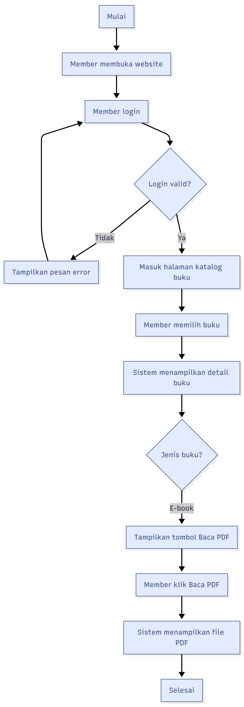
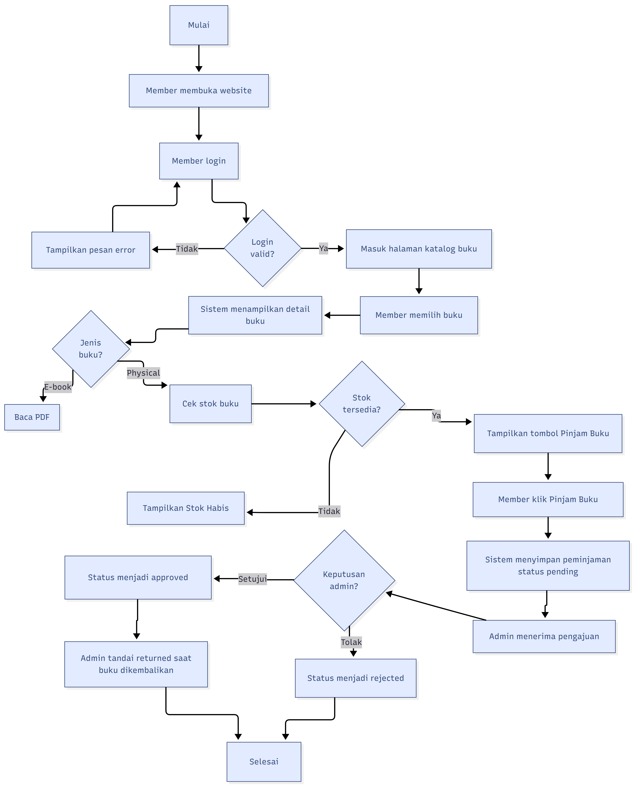
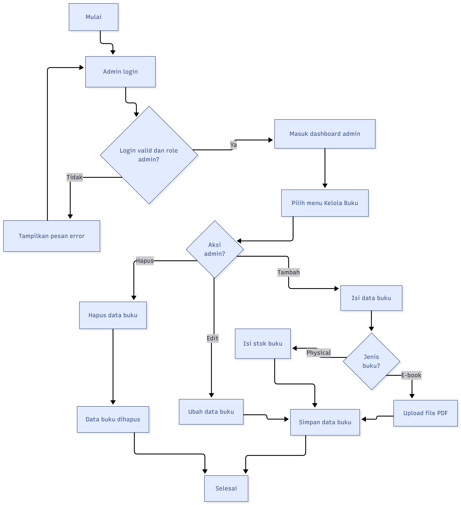
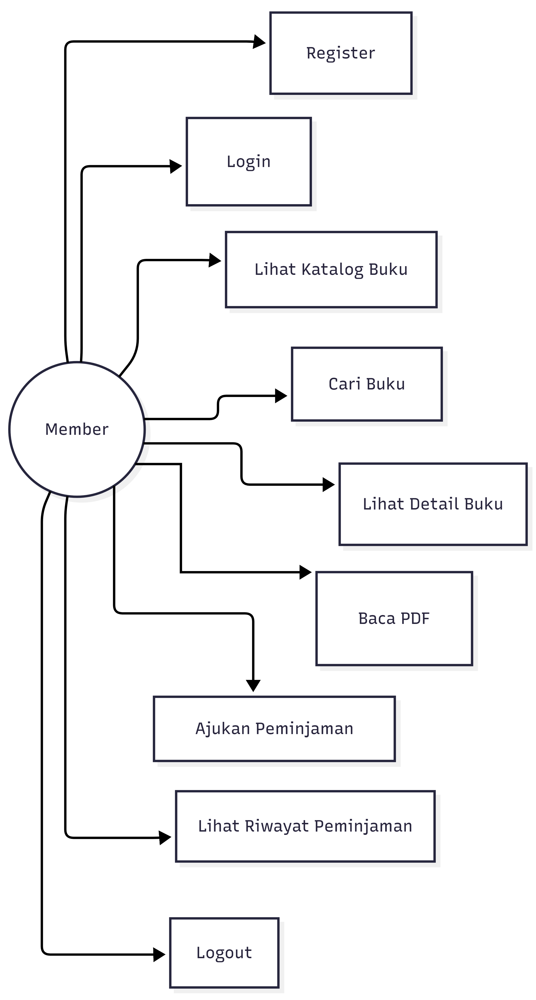
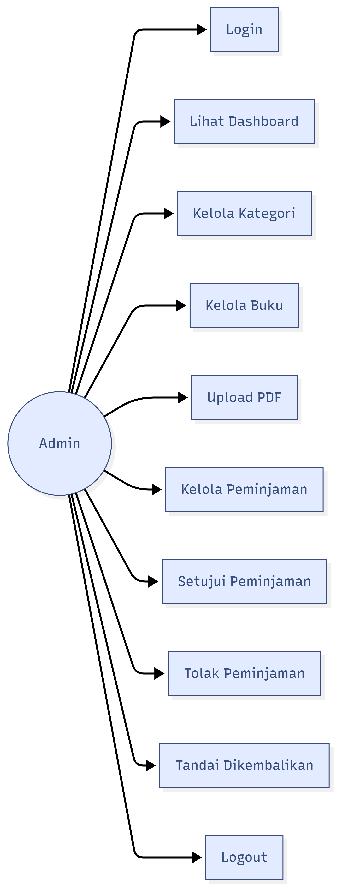
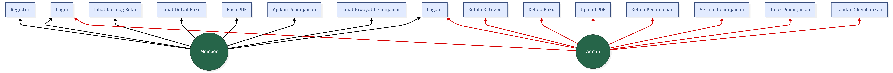

# FLOWCHART DAN USE CASE

# Sistem Manajemen Buku Digital

## 1. Flowchart Alur Member Membaca E-book

### Penjelasan Alur

Member melakukan login terlebih dahulu. Setelah berhasil login, member masuk ke halaman katalog buku dan memilih salah satu buku. Sistem menampilkan detail buku dan mengecek jenis buku. Jika buku tersebut merupakan e-book, maka sistem menampilkan tombol "Baca PDF". Setelah tombol diklik, sistem menampilkan file PDF kepada member.

## 2. Flowchart Alur Member Meminjam Buku Fisik

### Penjelasan Alur

Member memilih buku fisik dari katalog. Sistem mengecek stok buku. Jika stok tersedia, member dapat mengajukan peminjaman. Data peminjaman akan tersimpan dengan status `pending`. Admin kemudian memproses pengajuan tersebut dengan menyetujui atau menolak. Jika buku sudah dikembalikan, admin mengubah status peminjaman menjadi `returned`.

## 3. Flowchart Alur Admin Mengelola Buku

### Penjelasan Alur

Admin login ke sistem dan masuk ke dashboard. Pada menu Kelola Buku, admin dapat menambah, mengubah, atau menghapus data buku. Jika buku yang ditambahkan adalah e-book, admin perlu mengunggah file PDF. Jika buku adalah buku fisik, admin perlu mengisi jumlah stok buku.

## 4. Use Case Member

Aktor: "Member"

Use case:

1. Register.
2. Login.
3. Melihat katalog buku.
4. Mencari buku.
5. Melihat detail buku.
6. Membaca PDF.
7. Mengajukan peminjaman.
8. Melihat riwayat peminjaman.
9. Logout.

## 5. Use Case Admin

Aktor: "Admin"

Use case:

1. Login.
2. Melihat dashboard.
3. Mengelola kategori.
4. Mengelola buku.
5. Upload PDF.
6. Melihat data peminjaman.
7. Menyetujui peminjaman.
8. Menolak peminjaman.
9. Menandai buku dikembalikan.
10. Logout.

## 6. Use Case Gabungan

